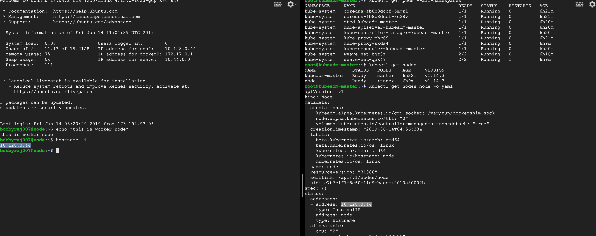
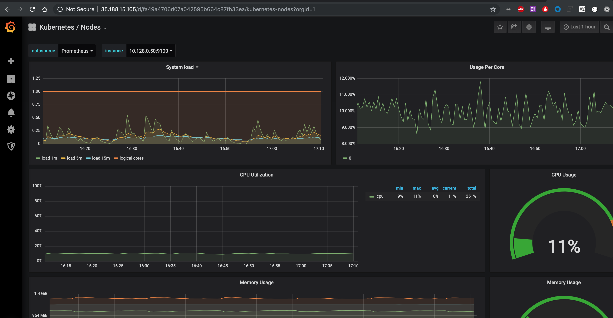

# k8sLevel2

### 1. Create a highly available kubernetes cluster manually using GKE

Create at least 2 VM in GCP for this task i.e. one for master and another one  for worked node.

Installing kubeadm consist mainly five parts
* Container runtime installation(CRI) 
* kubeadm, kubeclt & kubeadm installation
* Initialize kubeadm  
* Installing a pod network (used weave )
* Attaching worker node


#### CRI & kubeadm installation
```bash
    git clone https://github.com/BobbyRaj17/k8sLevel2.git
    cd k8s_cluster_installation
    sh k8s_cluster_installation_all_steps.sh
```
> NOTE : Execute all the script as root user

#### Initialize kubeadm

```bash
    kubeadm init
```
This will by default choose privateIP for `--apiserver-advertise-address`

#### 3. Installing a pod network
```bash
    sh pod_network_installation.sh
```

Note: you can start using the kubectl command using the the config file `/etc/kubernetes/admin.conf`

#### 4. Attaching worker node
perform the step 1 on worker node and then using the the below command join the master node

```bash
    kubeadm join <master-ip>:<master-port> --token <token> --discovery-token-ca-cert-hash sha256:"<hash>"
```

> NOTE: we have an issue with kubeadm  hosted in gcp while trying to initialize it with public-ip address - https://github.com/kubernetes/kubeadm/issues/1390
Please refer the below screen confirmation which shows the kubeadm cluster was installed correctly and highlighted node joined as worker

  


### 2. Create CI/CD pipeline using jenkins outside kubernetes cluster
I have used the declarative pipeline defined in Jenkinsfile that is available in the root directory of this repo

Currently it is just doing few basic things like getting the code from github, building & pushing container to registry & Helm deployment
> Note: I am running all the steps in a docker agent so that we can keep our jenkins clean & lightweight and we don't have to install anything dependency to Jenkins slave or master

Similar to steps like docker & helm we can integrate  `checkmarx`, `sonar`, `Anchore`  with our CI/CD and this can be used in both normal pipeline dashboard & as well as in `blue ocean`

### 3. Create a development namesapce 

 Using the kubectl &  `namespace-creation.yaml` available in the root directory of the repo we can create multiple namespaces.
  ```bash
  kube create -f namespace-creation.yaml
  ```

### 4. Deploy guestbook application in development namespace
Using the kubectl & `guestbook-deploy.sh` available in the root directory of the repo. 

please refer the below screenshot for more info
<PENDING>

### 5. Install & configure Helm in kubernetes

Installing helm
```bash
    curl -LO https://git.io/get_helm.sh
    chmod 700 get_helm.sh
    ./get_helm.sh
```

configuring helm 
Once you have Helm ready, you can initialize the local CLI and also install Tiller into your Kubernetes cluster in one step:
```bash
    helm init
```
Providing required permissions to tiller
```bash
    kubectl create serviceaccount --namespace kube-system tiller
    kubectl create clusterrolebinding tiller-cluster-rule --clusterrole=cluster-admin --serviceaccount=kube-system:tiller
    kubectl patch deploy --namespace kube-system tiller-deploy -p '{"spec":{"template":{"spec":{"serviceAccount":"tiller"}}}}'
```
please refer the below screenshot for more info
<PENDING>


### 6. Use helm to deploy an application using CI/CD
Covered this  in the second task of the assignment.

### 7. Create a monitoring namespace in the cluster
Using the kubectl &  `namespace-creation.yaml` available in the root directory of the repo we can create multiple namespaces.
```bash
    kube create -f namespace-creation.yaml
```

### 8 & 9 Setup Prometheus (in monitoring namespace) for gathering host/container metrics & create dashboard using grafana to visualize node/container/api
For Prometheus installation use the official prometheus-operator Helm chart. This chart has many options, so we need to design it as per our requirement

Let's enable persistent storage for all Prometheus components and also expose Grafana svc i.e. `prom-grafana` against loadbalancer. I prepared a custom values file under monitoring folder that will be used for installation with Helm 
```bash
    helm install --name prom --namespace monitoring -f custom-values.yaml stable/prometheus-operator
```
Wait a few minutes and the whole stack should be up and running. Check for all pods in monitoring namespace
This helm chart also installs prometheus alert-manager which can be also be accessed using `kubectl port-forward`

Exposed the grafana dashboard against a loadbalancer -> http://35.188.15.165/
  


### 10. Setup log analysis using Elasticsearch, Fluentd, Kibana.

Generated a helm manifest from the the helm chart after minor tweaks using this we can deploy it on kubernetes cluster
```bash
    kubectl create -f logging/elk.yaml
    kubectl create -f logging/es-operator.yaml
```
To search for the logs, use kubectl port-forward command on Kibana pod to access it. 
```bash
    kubectl port-forward <efk pod> 5601 -n logging
```

### 11. Demonstrate Blue/Green and Canary deployment for the application
```text
    > Canary
    
       - The canary release is a technique to reduce the risk of introducing a new software version in production by slowly rolling out the change to a small subset of users before rolling it out to the entire infrastructure.    
       - It is about to get an idea of how new version will perform (integrate with other apps, CPU, memory, disk usage, etc).
    
    > Blue/Green:
    
       - It is more about the predictable release with zero downtime deployment.
       - Easy rollbacks in case of failure.
       - Completely automated deployment process
```

